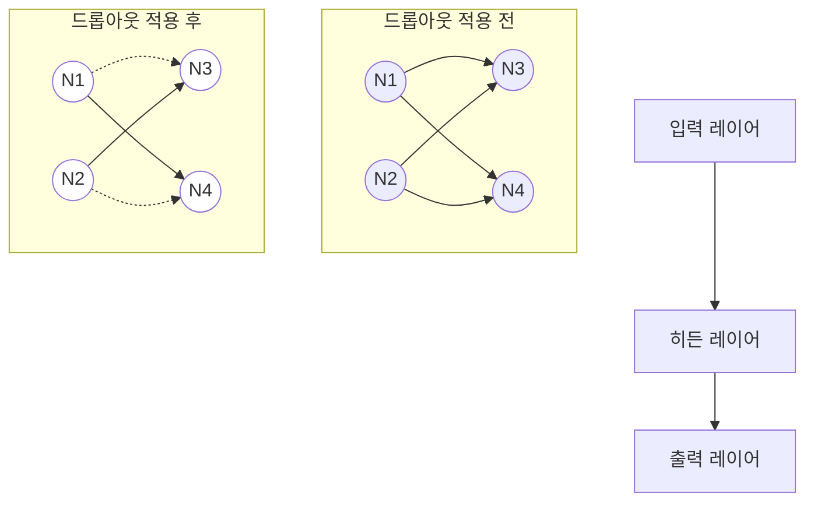
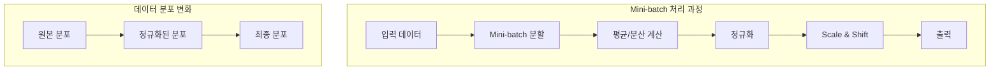

# Regularization

## 5.2 Regularization & Normalization

### Regularization (정칙화)

정칙화라고 불리며, 과적합(Overfitting)을 해결하기 위한 방법 중하나이다.

과적합 : Train Set는 매우 잘 맞히지만, Validation/test set은 맞히지 못하는 현상. - 기출문제는 외워서 잘맞히지만 새로운 응용 문제로 시험을 볼 때는 잘 풀지 못하는 경우이다.

Regularization 기법들은 모델에 제약을 걸어서 모델의 Train loss를 증가시키는 역할을 한다.

그래서 train loss는 약간 증가하지만 결과적으로, validation loss나 최종 test loss를 감소 시키려는 목적을 가지고 있다.

<aside>
💡

Regulation은 과적합을 막기 위해 사용되는 방법.

Regularization 방법들의 예시:

- **L1 Regularization (Lasso)**: 가중치의 절대값에 대해 페널티를 부과하여 일부 특성의 가중치를 0으로 만듦
- **L2 Regularization (Ridge)**: 가중치의 제곱에 대해 페널티를 부과하여 전체적으로 가중치를 작게 유지
- **Dropout**: 학습 과정에서 임의로 일부 뉴런을 비활성화하여 과적합 방지
- **Early Stopping**: 검증 세트의 성능이 더 이상 개선되지 않을 때 학습을 중단
- **Data Augmentation**: 훈련 데이터를 인위적으로 늘려 과적합 방지

이러한 방법들은 단독으로 또는 조합하여 사용할 수 있으며, 모델과 데이터의 특성에 따라 적절한 방법을 선택해야 합니다.

</aside>

### Normalization (정규화)

---

데이터의 형태를 트레이닝에 적합하게 전처리하는 과정이다. 

데이터를 z-score로 바꾸거나 min-max scaling을 통해 0과 1사이의 값으로 분포를 조정하는 것들이 해당.

모든 피쳐의 값의 범위를 동일하게 하여 모델이 풀어야 하는 문제를 간단하게 바꿔주는 전처리다.

<aside>
💡

Normalization은 트레이닝을 할 때에 서로 범위가 다른 데이터들을 같은 범위로 바꿪주는 전처리 과정

Normalization의 주요 방법들:

- **Min-Max Scaling**: 데이터를 0과 1 사이의 값으로 변환하는 방법
X_norm = (X - X_min) / (X_max - X_min)
- **Z-Score Normalization (Standard Scaling)**: 평균을 0, 표준편차를 1로 변환하는 방법
X_norm = (X - μ) / σ
- **Decimal Scaling**: 데이터를 10의 거듭제곱으로 나누어 정규화하는 방법

Normalization 예시:

- 키(170cm, 180cm, 160cm) → Min-Max Scaling → (0.5, 1.0, 0.0)
- 시험 점수(85, 90, 95) → Z-Score → (-1.0, 0.0, 1.0)
- 연봉(50000000원) → Decimal Scaling → 5000만원
</aside>

### 📌 선형 회귀 관련 코드 설명 표

| 코드 | 의미 / 역할 | 작동 방식 설명 |
| --- | --- | --- |
| `from sklearn.linear_model import LinearRegression` | 선형 회귀 모델 불러오기 | 기울기와 절편을 찾아 직선(1차 함수)으로 데이터를 설명함 |
| `from sklearn.linear_model import Lasso` | L1 정규화 회귀 모델 불러오기 | 선형 회귀에 **L1 패널티**를 줘서 일부 기울기를 0으로 만듦 (특성 선택에 유리) |
| `from sklearn.linear_model import Ridge` | L2 정규화 회귀 모델 불러오기 | 선형 회귀에 **L2 패널티**를 줘서 과도한 기울기를 줄임 (과적합 방지) |
| `model = LinearRegression()model = Lasso()model = Ridge()` | 모델 객체 생성 | 각각의 선형 모델 객체를 메모리에 올림 (아직 학습은 안 함) |
| `X = np.array(X)Y = np.array(Y)` | 리스트 → 넘파이 배열 변환 | sklearn은 넘파이 배열을 입력으로 받기 때문에 필수 전처리 |
| `model.fit(X.reshape(-1, 1), Y)` | 모델 학습 | 입력 X, 정답 Y를 이용해 기울기와 절편을 내부적으로 계산함  `reshape(-1, 1)`은 1차원 리스트를 2차원으로 바꿔주는 과정 (열벡터로 바꾸기) |
| `model.coef_` | 학습된 기울기 (계수) | 학습 완료 후 자동 생성됨. 배열 형태이며, 각 특성의 기울기를 의미 |
| `model.intercept_` | 학습된 절편 | 선형 함수에서 y절편에 해당하는 값 |
| `model.predict(X.reshape(-1, 1))` | 예측 결과 계산 | 학습한 직선에 X값을 넣어 y값을 예측함 |

## 5.3 L1 Regularization

---

5.2에서는 Regularization 과 Normalization의 정의를 설명하고, L1/L2 regularization을 코드로 맛보기 해보았습니다.

L1 = `Lasso()` 로는 regression 문제가 제대로 풀리지 않았던 현상을 더 자세히 살펴본다.
그리고 어떤 때에 L1 regularization을 사용하는지 알아보는 것이 목표!!

**L1 regularization은 다음과 같은 수식으로 정의됩니다. (N: 데이터의 개수, D: 데이터의 차원(특성의 개수))**

L1 Regularization 수식을 시각적으로 이해하면 다음과 같은 두 부분으로 구성됩니다:

- **기본 손실 함수 부분:** (1/2N)∑(yi - β0 - ∑xijβj)²
    - 일반적인 선형 회귀의 평균 제곱 오차
- **정규화 항:** λ∑|βj|
    - 가중치(β)의 절대값에 대한 페널티
    - 이 항이 L1 norm을 나타내며 L1 regularization의 핵심

이 수식에서:

- N: 데이터의 개수
- D: 데이터의 차원(특성의 개수)
- λ (lambda): 정규화 강도를 조절하는 하이퍼파라미터

$$
\hat{\beta}^{lasso} := \arg\min_{\beta} \left\{ \frac{1}{2N} \sum_{i=1}^{N} \left( y_i - \beta_0 - \sum_{j=1}^{D} x_{ij} \beta_j \right)^2 + \lambda \sum_{j=1}^{D} |\beta_j| \right\}
$$

L1 Regularization 수식을 시각적으로 이해하면 다음과 같은 두 부분으로 구성됩니다:

- **기본 손실 함수 부분:** (1/2N)∑(yi - β0 - ∑xijβj)²
    - 일반적인 선형 회귀의 평균 제곱 오차
- **정규화 항:** λ∑|βj|
    - 가중치(β)의 절대값에 대한 페널티
    - 이 항이 L1 norm을 나타내며 L1 regularization의 핵심

이 수식에서:

- N: 데이터의 개수
- D: 데이터의 차원(특성의 개수)
- λ (lambda): 정규화 강도를 조절하는 하이퍼파라미터

여기서 중요하게 보아야할 부분은 마지막 정규화 항이다. L2 와의 가장 큰 차이가 나는 부분

<aside>
💡

Lp norm 은 벡터나 행렬,함수 등의 거리를 나타내는 것으로 여기서는 벡터값만 다룰 예정.

Lp norm은 벡터의 크기를 측정하는 방법으로, p가 1일 때는 L1 norm, 2일 때는 L2 norm이라고 합니다.

$$
L_p = \left(\sum_{i=1}^n |x_i|^p\right)^{\frac{1}{p}}
$$

주요 Lp norm:

- **L1 norm (Manhattan distance)**: 벡터 요소들의 절대값의 합
|x₁| + |x₂| + ... + |xₙ|
- **L2 norm (Euclidean distance)**: 벡터 요소들의 제곱합의 제곱근
√(x₁² + x₂² + ... + xₙ²)
- **L∞ norm (Maximum norm)**: 벡터 요소들의 절대값 중 최대값
max(|x₁|, |x₂|, ..., |xₙ|)

머신러닝에서는 주로 L1과 L2 norm이 regularization에 사용됩니다.

</aside>

---

MAE, MSE, MRSE 에 대한 설명을 진행해주세요.

### MAE (Mean Absolute Error)

예측값과 실제값 차이의 절대값 평균

$$
MAE = \frac{1}{n} \sum_{i=1}^{n} |y_{true} - y_{pred}|
$$

- 이상치에 덜 민감
- 직관적인 해석 가능

### MSE (Mean Squared Error)

예측값과 실제값 차이의 제곱 평균

$$
MSE = \frac{1}{n} \sum_{i=1}^{n} (y_{true} - y_{pred})^2
$$

- 큰 오차에 더 큰 페널티
- 미분 가능하여 최적화에 유리

### RMSE (Root Mean Squared Error)

MSE의 제곱근 값

$$
RMSE = \sqrt{\frac{1}{n} \sum_{i=1}^{n} (y_{true} - y_{pred})^2}
$$

- 원본 데이터와 같은 단위로 해석
- 실무에서 가장 널리 사용

## L2 Regularization

**L2 regularization은 아래와 같은 식으로 정의됩니다.**

$$
\hat{\beta}^{ridge} := \arg\min_{\beta} \left\{ \frac{1}{2N} \sum_{i=1}^{N} \left( y_i - \beta_0 - \sum_{j=1}^{D} x_{ij} \beta_j \right)^2 + \lambda \sum_{j=1}^{D} \beta_j^2 \right\}
$$

**아래는 L1 regularization의 정의입니다.**

$$
\hat{\beta}^{lasso} := \arg\min_{\beta} \left\{ \frac{1}{2N} \sum_{i=1}^{N} \left( y_i - \beta_0 - \sum_{j=1}^{D} x_{ij} \beta_j \right)^2 + \lambda \sum_{j=1}^{D} |\beta_j| \right\}
$$

정규화 부분에서 L2 norm이랑 같음

### L1/L2 Regulation의 차이점

---

L1 regularization이 L2 regularization과 다르게 왜 일부 컬럼의 가중치를 0으로 보내는지 증명하는 내용은 이 노드의 범위를 벗어나기 때문에, 대략적으로만 설명해 보겠습니다.


L1과 L2 정규화의 핵심적인 차이점을 기하학적 관점에서 설명하면 다음과 같습니다:

- L1 정규화 (Lasso):
    - 마름모 형태의 제약 조건을 만듦
    - 최적해가 축 위에서 발생할 가능성이 높음
    - 결과적으로 일부 가중치(coefficient)들이 정확히 0이 되는 특성이 있음
- L2 정규화 (Ridge):
    - 원형의 제약 조건을 만듦
    - 최적해가 축 위가 아닌 곳에서 발생할 가능성이 높음
    - 대부분의 가중치가 0에 가깝지만 정확히 0이 되지는 않음
    - L1보다 빠른 수렴 속도를 보임

이러한 특성 때문에, L1 정규화는 특성 선택(feature selection) 효과가 있어 중요하지 않은 특성들을 자동으로 제거하는 데 유용하며, L2 정규화는 모든 특성을 유지하면서 과적합을 방지하는 데 효과적입니다.

L2 정규화가 L1 정규화보다 빠른 수렴 속도를 보이는 이유는 다음과 같습니다:

- **미분 가능성:** L2는 모든 점에서 미분이 가능하지만, L1은 0에서 미분이 불가능합니다. 이로 인해 L2가 최적화 과정에서 더 안정적인 그래디언트를 제공합니다.
- **그래디언트의 특성:** L2의 그래디언트는 가중치에 비례하여 부드럽게 변화하지만, L1은 항상 동일한 크기의 그래디언트를 가집니다. 이로 인해 L2가 더 효율적으로 최적점에 도달할 수 있습니다.
- **최적화 알고리즘 친화성:** L2의 부드러운 특성은 대부분의 최적화 알고리즘(예: 경사하강법)과 더 잘 작동하며, 이는 더 빠른 수렴으로 이어집니다.

## 5.5 Lp.norm

Norm은 벡터뿐만 아니라 함수, 행렬의 크기를 나타내는 개념으로 딥러닝을 배우는 과정에서 주로 벡터, 좀 더 어렵게는 행렬의 norm 정도만 알면 된다.

### Vector norm

---

L1/L2 정규화에서의 벡터 norm을 수식으로 표현하면 다음과 같습니다:

$$
||x||_p = \left(\sum_{i=1}^n |x_i|^p\right)^{\frac{1}{p}}
$$

이는 p-norm의 일반적인 형태이며, p=1일 때 L1 norm, p=2일 때 L2 norm이 됩니다.

- `p=1`이면 **맨해튼 거리**
- `p=2`이면 **유클리드 거리(일반적인 거리)**
- `p=∞`이면 **최댓값(norm)**
- `p`가 커질수록 → 가장 큰 값에 더 민감해짐

예를 들어 2차원에서

```
x = [3, 4]
```

면 일반적인 거리(= 2-노름)는 √(3² + 4²) =**5**

### Matrix norm

---

행렬 norm의 경우는 벡터와 조금 다르며, p = 1 , p= infinity 만 알면 된다.

현재 `A = m x n` 

Matrix norm 수식은 다음과 같이 표현됩니다:

$$
||A||_1 = \max_{1 \leq j \leq n} \sum_{i=1}^m |a_{ij}|
$$

$$
||A||_{\infty} = \max_{1 \leq i \leq m} \sum_{j=1}^n |a_{ij}|
$$

p = 1 일 경우 column의 합이 가장 큰 값이 출력되고, p = inf 일 경우 row의 합이 가장 큰값이 출력된다. 

```python
A = np.array([[1,2,3], [1,2,3], [4,6,8]])

one_norm_A = np.linalg.norm(A, ord=1)
print("result one norm of A :", one_norm_A)

inf_norm_A = np.linalg.norm(A, ord=np.inf)
print("result inf norm of A :", inf_norm_A)

# result one norm of A : 14.0
# result inf norm of A : 18.0
```

## 5.6 DropOut

---

드롭아웃(Dropout)에 대해 시각화와 함께 설명해드리겠습니다:



드롭아웃은 다음과 같은 특징을 가집니다:

1. 확률적 선택: 랜덤하게 일부 뉴런만 선택하여 정보를 전달
2. 오버피팅 방지: Regularization 기법의 하나로 과적합을 막는 역할
3. 균형잡힌 활성화 비율이 중요:
- 높은 비활성화 비율: 정보 전달이 부족해 학습 성능 저하
- 낮은 비활성화 비율: Fully Connected Layer와 유사하게 동작

실제 적용 예시:

```python
import tensorflow as tf

model = tf.keras.Sequential([
    tf.keras.layers.Dense(128, activation='relu'),
    tf.keras.layers.Dropout(0.3),  # 30%의 뉴런을 비활성화
    tf.keras.layers.Dense(64, activation='relu'),
    tf.keras.layers.Dropout(0.2),  # 20%의 뉴런을 비활성화
    tf.keras.layers.Dense(10, activation='softmax')
])

```

드롭아웃은 특히 Fully Connected Layer에서 오버피팅이 발생할 때 효과적으로 사용됩니다.

## 5.7 Batch Normalization

딥러닝에서 가중치를 업데이트하는 경사 하강법(Gradient Descent)에는 다음과 같은 방법들이 있습니다:

- **Batch Gradient Descent (배치 경사 하강법)**- 데이터셋 전체를 한 번에 처리한 후 가중치 업데이트
- 장점: 안정적인 학습
- 단점: 메모리 많이 사용, 학습 속도 느림
- **Stochastic Gradient Descent (확률적 경사 하강법)**- 데이터 하나씩 처리할 때마다 가중치 업데이트
- 장점: 빠른 학습, 적은 메모리 사용
- 단점: 불안정한 학습
- **Mini-batch Gradient Descent (미니배치 경사 하강법)**- 데이터셋을 작은 배치로 나누어 처리
- 장점: 학습 속도와 안정성의 균형
- 단점: mini-batch들 사이의 데이터 분포 차이 발생 (Internal Covariate Shift)

`Internal Covariate Shift`로 인해 발생하는 문제:

- 데이터 분포 차이로 인한 gradient 값 변화
- gradient vanishing/exploding 문제 발생 가능성

이러한 문제를 해결하기 위해 Batch Normalization이 제안되었습니다. 이 기법은:

1. 각 mini-batch의 평균과 분산을 계산
2. 정규화(normalization) 수행
3. scale and shift 변환 적용

이를 통해 mini-batch들이 유사한 데이터 분포를 가지도록 만듭니다.

Batch Normalization에 대해 다음과 같이 시각화하여 설명하겠습니다:

---

딥러닝에서 자주 발생하는 문제들에 대해 설명해드리겠습니다:

**Gradient Vanishing (기울기 소실)**

- 신경망이 깊어질수록 역전파 과정에서 기울기(gradient) 값이 점점 작아져서 거의 0에 가까워지는 현상
- 이로 인해 모델의 학습이 제대로 이루어지지 않음

**Gradient Exploding (기울기 폭발)**

- Gradient Vanishing과 반대로 기울기 값이 기하급수적으로 커지는 현상
- 이로 인해 모델이 불안정해지고 학습이 실패할 수 있음

**Internal Covariate Shift**

- 각 레이어를 통과할 때마다 입력 데이터의 분포가 변하는 현상
- 이로 인해 gradient 값이 불안정해지고, 위에서 설명한 gradient vanishing/exploding 문제가 발생할 수 있음

이러한 문제들을 해결하기 위해 Batch Normalization과 같은 정규화 기법들이 사용됩니다.



**Batch Normalization**의 주요 특징:

1. Mini-batch Gradient Descent의 개선: 전체 배치와 단일 데이터 처리의 절충안으로, mini-batch 단위로 처리
2. Internal Covariate Shift 해결: mini-batch들 사이의 데이터 분포 차이 문제를 해결
3. 경사 소실/폭발 방지: 데이터 분포를 정규화하여 gradient vanishing/exploding 문제 해결
4. Scale and Shift 변환: 정규화 후 추가적인 변환을 통해 데이터 분포 조정

이를 통해 모델의 학습 안정성과 성능을 향상시킬 수 있습니다.

---

**Input**

Values of x over a mini-batch:

$$
B = \{x_1,...,x_m\}
$$

Parameters to be learned:

$$
\gamma, \beta
$$

Output:

$$
y_i = BN_{\gamma,\beta}(x_i)
$$

- mini-batch mean:

$$
\mu_B \leftarrow \frac{1}{m}\sum_{i=1}^m x_i
$$

- mini-batch variance:

$$
\sigma_B^2 \leftarrow \frac{1}{m}\sum_{i=1}^m (x_i-\mu_B)^2
$$

- normalize:

$$
\hat{x}_i \leftarrow \frac{x_i-\mu_B}{\sqrt{\sigma_B^2 + \epsilon}}
$$

- scale and shift:

$$
y_i \leftarrow \gamma\hat{x}_i + \beta \equiv BN_{\gamma,\beta}(x_i)
$$

위 수식을 풀어서 설명해 드리면 batch normalization은 mini-batch의 평균

$$
μ_B
$$

과 분산

$$
σ_B^2
$$

을 구해서 입력 데이터를 정규화(normalize)하고, 이 값에 scale

$$
γ
$$

과 shift

$$
β
$$

를 추가한 것입니다. 결국 입력 데이터

$$
x_i
$$

는 batch normalization을 거쳐

$$
y_i = γ\hat{x}_i + β
$$

이 됩니다.

- 수식에 ε이 포함된 이유는 분산(σB²)이 0이 될 경우 나눗셈 오류가 발생하는 것을 방지하기 위해서입니다.**εσB**
- γ와 β는 학습 파라미터로, 모델 학습이 진행되면서 가중치와 함께 업데이트됩니다.

기존의 fully connected layer도 좋은 성능을 보이지만, batch normalization을 추가하면 정확도가 더 빠르게 상승하고 loss 함수도 더 빠르게 감소합니다. batch normalization은 데이터 분포를 정규화하여 더 균일한 분포를 만들며, 모델과 함께 학습되는 γ, β 파라미터를 통해 데이터 분포를 적절하게 변환함으로써 더욱 안정적인 학습이 가능해집니다.