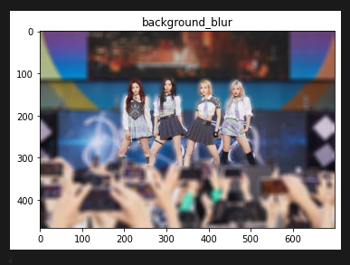

# AIFFEL Campus Online Code Peer Review Templete
- 코더 : 김영기
- 리뷰어 : 임한결

# PRT(Peer Review Template)
- [X]  **1. 주어진 문제를 해결하는 완성된 코드가 제출되었나요?**
    - 문제에서 요구하는 최종 결과물이 첨부되었는지 확인
        - 중요! 해당 조건을 만족하는 부분을 캡쳐해 근거로 첨부
    
    
    - 인물과 배경을 성공적으로 분리하고, 배경을 적절하게 blur 처리했다.  
    

    - 여러 명의 인물(에스파 멤버들)과 배경(주위의 손들)을 성공적으로 분리하고, 배경을 적절하게 blur 처리했다.  
    

    - 고양이와 배경을 성공적으로 분리하고, 배경을 적절하게 blur 처리했다.  
    

    - 고양이와 사람을 배경과 성공적으로 분리하고, 배경을 적절하게 blur 처리했다.  
    


- [X]  **2. 전체 코드에서 가장 핵심적이거나 가장 복잡하고 이해하기 어려운 부분에 작성된 
주석 또는 doc string을 보고 해당 코드가 잘 이해되었나요?**
    - 해당 코드 블럭을 왜 핵심적이라고 생각하는지 확인
    - 해당 코드 블럭에 doc string/annotation이 달려 있는지 확인
    - 해당 코드의 기능, 존재 이유, 작동 원리 등을 기술했는지 확인
    - 주석을 보고 코드 이해가 잘 되었는지 확인
        - 중요! 잘 작성되었다고 생각되는 부분을 캡쳐해 근거로 첨부

    - 여러 주석과 사용자 친화적인 코드를 통해 복잡할 수 있는 코드를 쉽게 이해할 수 있게 도움  
      
    

    - Markdown으로도 코드 진행 사항과 애로사항을 기록하여, 흐름을 이해하는 데 도움이 됨  
    

    - 중간중간 출력문을 통해 코드 진행 상황을 확인 가능  
    
        
- [X]  **3. 에러가 난 부분을 디버깅하여 문제를 해결한 기록을 남겼거나
새로운 시도 또는 추가 실험을 수행해봤나요?**
    - 문제 원인 및 해결 과정을 잘 기록하였는지 확인
    - 프로젝트 평가 기준에 더해 추가적으로 수행한 나만의 시도, 
    실험이 기록되어 있는지 확인
        - 중요! 잘 작성되었다고 생각되는 부분을 캡쳐해 근거로 첨부
        .  
    - 코드 동작 중 발생한 에러를 찾아내고 수정하여 요구사항을 성공적으로 만족  
    

- [X]  **4. 회고를 잘 작성했나요?**
    - 주어진 문제를 해결하는 완성된 코드 내지 프로젝트 결과물에 대해
    배운점과 아쉬운점, 느낀점 등이 기록되어 있는지 확인
    - 전체 코드 실행 플로우를 그래프로 그려서 이해를 돕고 있는지 확인
        - 중요! 잘 작성되었다고 생각되는 부분을 캡쳐해 근거로 첨부
    - 회고를 통해 배운 점과 이해한 점 등을 상세히 기록  
    

- [X]  **5. 코드가 간결하고 효율적인가요?**
    - 파이썬 스타일 가이드 (PEP8) 를 준수하였는지 확인
    - 코드 중복을 최소화하고 범용적으로 사용할 수 있도록 함수화/모듈화했는지 확인
        - 중요! 잘 작성되었다고 생각되는 부분을 캡쳐해 근거로 첨부

    - 모듈화를 통해 재사용 가능하게 했고, 과정별 역할을 명확히 분리함  
    

# 회고(참고 링크 및 코드 개선)
```
# 리뷰어의 회고를 작성합니다.
# 코드 리뷰 시 참고한 링크가 있다면 링크와 간략한 설명을 첨부합니다.
# 코드 리뷰를 통해 개선한 코드가 있다면 코드와 간략한 설명을 첨부합니다.
```
앞서 기존의 요구사항 수행하는 코드를 잘 작성하고, 계속해서 새로운 기능과 문제를 해결하기 위해
다양한 방식으로 코드를 재작성하고, 고치는 과정이 매우 인상적이었습니다.
다만, global로 변수를 지정하여 코드를 작성하는 방식이 코드 관리에 약간의 문제가 될 수 있어 보입니다.

<pre><code>
def load_image():
    filename = input('파일이름을 알려주세요: ')
    global img_path, img_orig
    ...

load_image()

->
def load_image(img_path, img_orig):
    ...

img_path = "img 경로"
img_orig = cv2.imread(img_path)
load_image(img_path, img_orig)
</code></pre>

위와 같이 객체와 하이퍼파라메터를 잘 활용해서 코드를 작성하면 좋아 보입니다.
```
